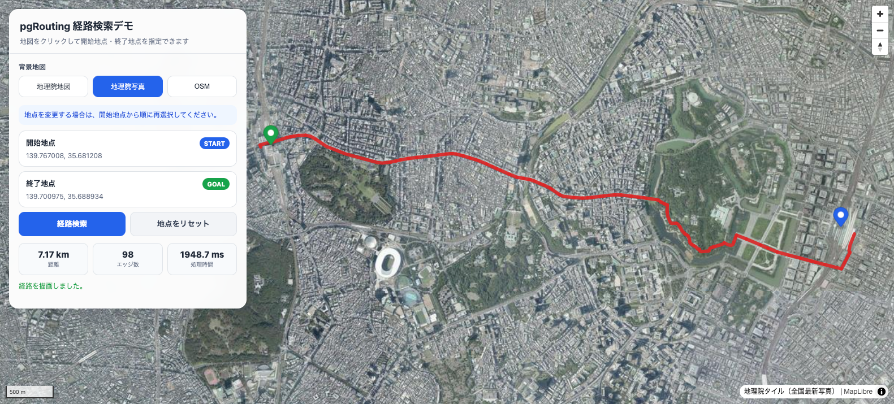

# 国土数値情報 道路中心線 → PostGIS / pgRouting 自動構築

`data/input`へShapefile一式を置き、DockerでETLを実行すると、次を自動生成します。

- `source.n13_road_raw`：原本統合テーブル（EPSG:6668）
- `work.road_lines`：LineString化済み道路
- `work.road_walkable`：徒歩経路候補
- `routing.road_vertices`：道路端点ノード
- `routing.road_edges`：pgRouting用エッジ
- `audit.network_summary`：接続状況の集計

## 1. 元データ配置

```text
data/input/N13-24_5339/
├── N13-24_5339.shp
├── N13-24_5339.shx
├── N13-24_5339.dbf
├── N13-24_5339.prj
└── N13-24_5339.cpg  # 存在する場合
```

`data/input`配下は再帰検索されるため、複数メッシュをサブディレクトリへ分けて配置できます。

## 2. 起動・構築

```bash
cp .env.example .env
docker compose build
docker compose up -d db
docker compose run --rm etl
```

検証CSVは`data/output`へ出力されます。

## 3. DB確認

```bash
docker compose exec db psql -U postgres -d regional_map
```

```sql
SELECT * FROM audit.network_summary;
SELECT COUNT(*) FROM routing.road_edges;
SELECT COUNT(*) FROM routing.road_vertices;
```

## 4. 最短経路

```sql
SELECT *
FROM pgr_dijkstra(
  'SELECT id, source, target,
          length_m AS cost,
          length_m AS reverse_cost
   FROM routing.road_edges',
  100,
  200,
  directed := false
);
```

## 5. 任意座標の最寄りノード

```sql
WITH p AS (
  SELECT ST_Transform(
    ST_SetSRID(ST_Point(139.5065, 35.6998), 4326),
    6668
  ) AS geom
)
SELECT v.id,
       ST_Distance(v.geom::geography, p.geom::geography) AS distance_m
FROM routing.road_vertices v
CROSS JOIN p
ORDER BY v.geom <-> p.geom
LIMIT 1;
```


## 6. Web画面

`webapp`ディレクトリには、MapLibre GL JSを使った経路検索デモ画面を配置します。

```text
webapp/
├── index.html
└── route.php
```

- `index.html`：地図表示、背景地図切替、開始・終了地点の選択、経路描画
- `route.php`：PostGIS／pgRoutingへ問い合わせ、検索結果をGeoJSONで返すAPI

### 6.1 Webコンテナの起動

`docker-compose.yml`に`web`サービスが定義されている場合は、次のコマンドで起動します。

```bash
docker compose build web
docker compose up -d db web
```

コンテナの状態を確認します。

```bash
docker compose ps
```

Web画面は、初期設定では次のURLで開きます。

```text
http://localhost:8080/
```




公開ポートは、`.env`の`WEB_PORT`で変更できます。

```env
WEB_PORT=8080
```

### 6.2 画面操作

1. 背景地図を選択します。
    - 地理院地図
    - 地理院写真
    - OpenStreetMap
2. 地図上をクリックして開始地点を指定します。
3. 続けて地図上をクリックして終了地点を指定します。
4. 「経路検索」を押します。
5. 計算された経路が地図上に表示されます。

画面には次の情報を表示します。

- 経路距離
- 経路を構成するエッジ数
- サーバー側の検索処理時間
- 開始地点・終了地点の座標

「地点をリセット」を押すと、選択地点と検索結果を消去できます。

### 6.3 経路検索ロジック

Web画面から渡された開始・終了座標に対して、次の順序で検索します。

1. 各座標に最も近い`routing.road_vertices`の頂点を検索
2. 2点を囲む矩形に余白を加えて検索範囲を作成
3. 検索範囲内の`routing.road_edges`だけを抽出
4. `pgr_dijkstra`で距離最短経路を計算
5. 経路に含まれる道路形状をEPSG:4326へ変換
6. GeoJSONとしてWeb画面へ返却
7. MapLibre GL JSで経路を描画

現在の経路コストは`length_m`です。

```sql
length_m AS cost,
length_m AS reverse_cost
```

そのため、検索結果は「所要時間最短」ではなく、道路距離が最短となる経路です。また、現在は`directed := false`のため、一方通行は考慮しません。

### 6.4 検索範囲

全エッジを毎回pgRoutingへ渡すと検索が重くなるため、開始地点と終了地点の周辺だけに絞り込んでいます。

```sql
WHERE geom && ST_MakeEnvelope(...)
```

検索余白の初期値は`0.05度`です。長距離経路や大きな迂回が必要な場所では、検索範囲が不足して経路が見つからない場合があります。その場合は余白を広げるか、狭い範囲から段階的に再検索する処理を追加してください。

### 6.5 Web APIの確認

ブラウザを使わずにAPIだけ確認する場合は、次のように実行します。

```bash
curl "http://localhost:8080/route.php?start_lng=139.767125&start_lat=35.681236&end_lng=139.700258&end_lat=35.690921&margin=0.05"
```

正常時はGeoJSONの`FeatureCollection`が返ります。

### 6.6 Webコンテナのログ確認

画面が表示されない場合やAPIエラーが発生した場合は、次を確認します。

```bash
docker compose logs web --tail=100
```

PHPからPostgreSQLへ接続する際のホスト名は、Docker Composeのサービス名である`db`です。

```text
PGHOST=db
PGPORT=5432
PGDATABASE=regional_map
PGUSER=postgres
```

Macホストから接続する場合の`localhost:5432`とは異なる点に注意してください。


## 7. 再実行

初期値では毎回原本テーブルを空にして再構築します。

```env
RESET_SOURCE=true
```

追加投入する場合のみ`false`へ変更します。同じShapefileを重ねて入れないでください。

## 8. 自動処理の範囲と制約

この版は、道路の始点・終点座標が完全一致する箇所を同一ノードにします。

自動補正しないもの：

- 微小な端点ずれ
- 道路途中へ接続するT字路
- 交差しているが線が分割されていない交差点
- メッシュ境界の位置ずれ

全国一律でスナップすると、橋・高架・トンネル・並行道路を誤接続する危険があるためです。まず`audit.network_summary`の連結成分数を確認し、必要地域だけローカル投影座標系で補正してください。

## 9. 注意

Dockerイメージのタグは環境に応じて更新が必要な場合があります。`Dockerfile.db`はPostgreSQL 16 / PostGIS 3.4を基準にしています。
